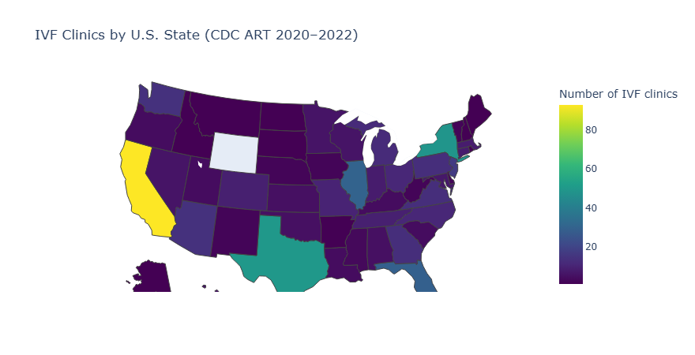
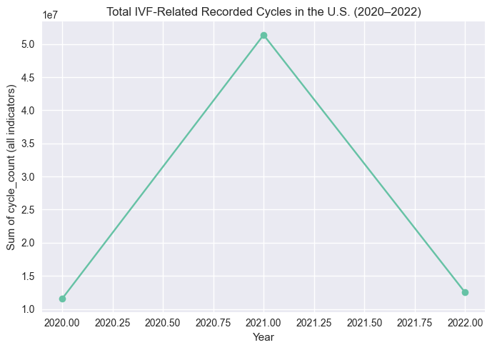
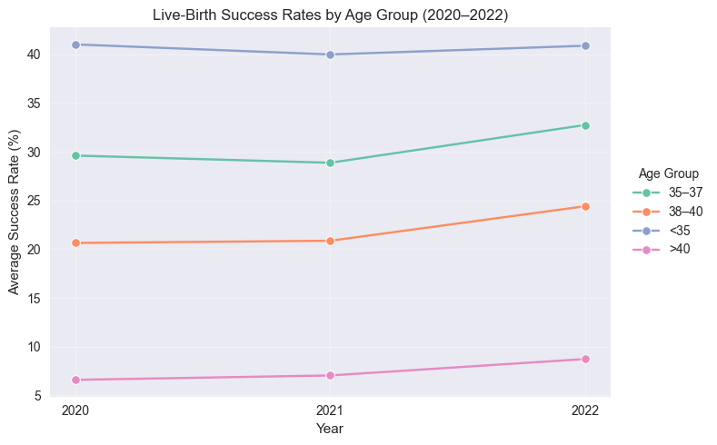
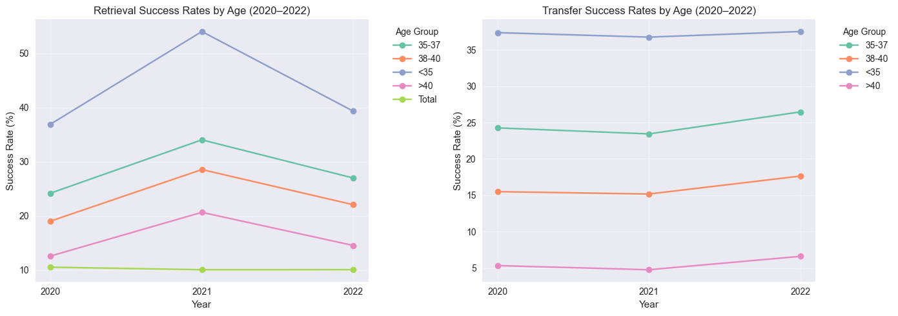
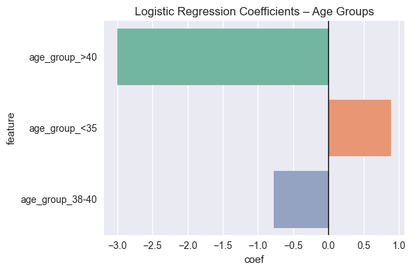
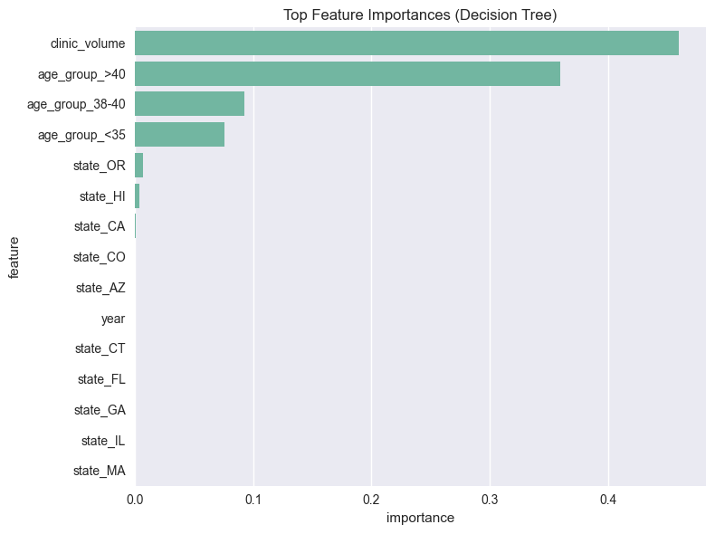
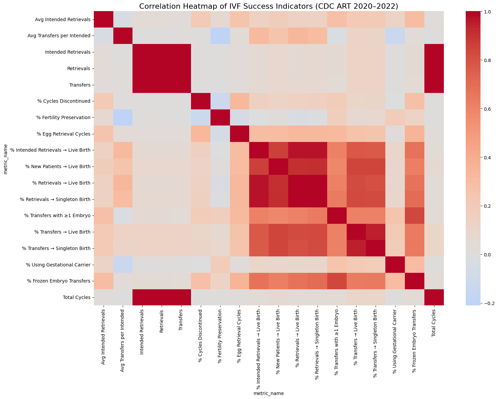

# 📊 Final Visualizations

This page presents all final charts used in the analysis and presentation of the project **“Analysis of IVF Trends in the United States (2020–2022)”**.  
Each visualization includes a short caption explaining its purpose and insights.

## 🗺️ 1. IVF Clinic Distribution Across the United States

  
**Caption:** This choropleth map shows how IVF clinics are distributed across U.S. states. States like California, Texas, New York, and Florida have the highest concentration of clinics, while many states have very limited access.

## 📈 2. IVF Cycle Volume Trends (2020–2022)

  
**Caption:** Total IVF cycle volume shows noticeable fluctuation across the three years, reflecting the impact of the pandemic and recovery period on ART services.

## 👶 3. Success Rates by Age Group

  
**Caption:** IVF success rates decline sharply after age 37. Patients under 35 consistently show the highest success probabilities, while success rates remain lowest for ages 40+.

## 🏥 4. Clinic Volume vs. Success Rate

  
**Caption:** Clinics with higher annual cycle volumes generally achieve stronger outcomes. High volume appears to be a reliable predictor of above-average success.

## 🤖 5. Logistic Regression - Feature Importance

  
**Caption:** Logistic Regression highlights **age group** as the strongest predictors of IVF success. State-level effects also play a notable role. Age_group_<35 shows a strong positive coefficient, making it the most favorable group for success

## 🌳 6. Decision Tree – Feature Importance

  
**Caption:** The Decision Tree identifies **clinic volume** as the most impactful variable, reinforcing the findings from logistic regression. The model also reveals threshold behaviors in success outcomes.

## 🔥 7. Correlation Heatmap

  
**Caption:** The heatmap shows strong correlations between key IVF indicators, such as transfers, retrieval outcomes, and live birth rates. These relationships help explain clinical patterns across the dataset.
